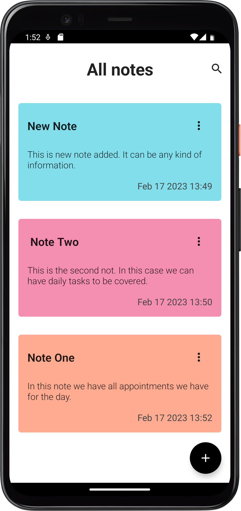
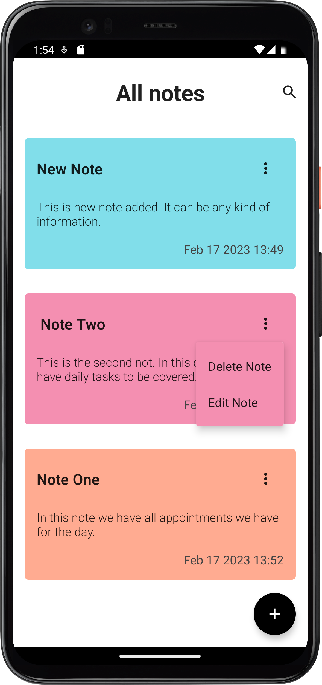
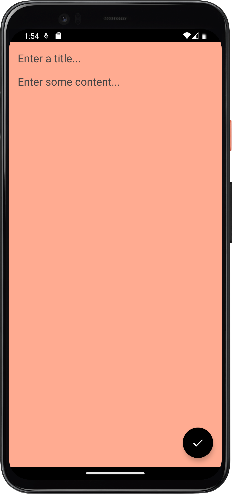
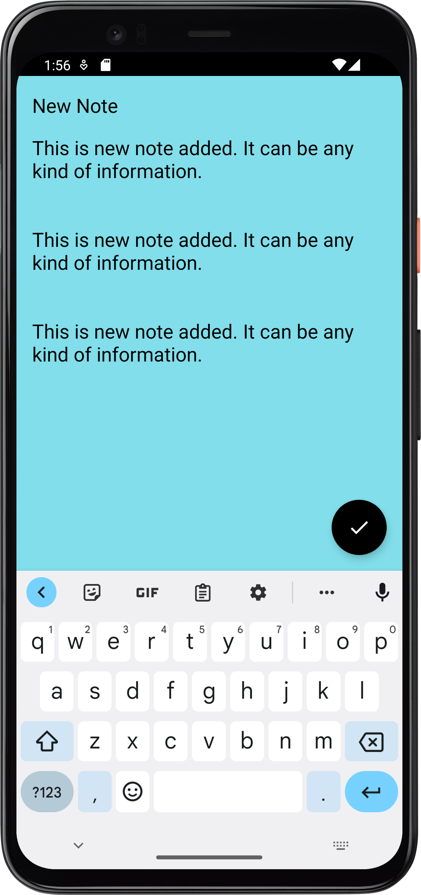

# NoteApp
This simple app demostrates how to use kotlin multip-platform to develop apps for both iOS and Android. 
## Technology Stack
- Compose
- Swift UI
- Sqlight database
- Kotlin
-Swift/Xcode

## Android of UI

## iOS App of swift UI

